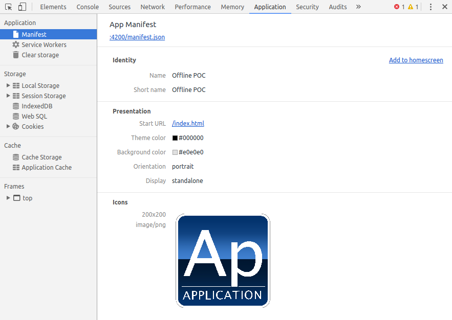
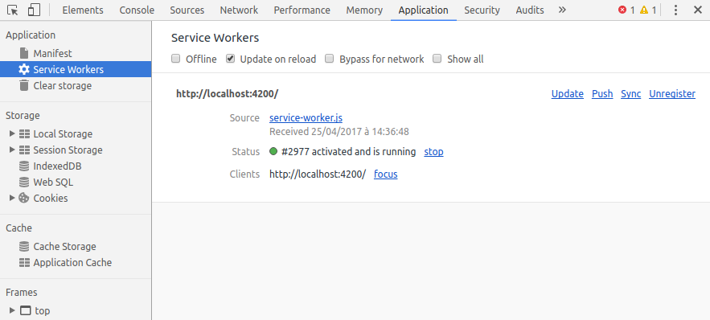
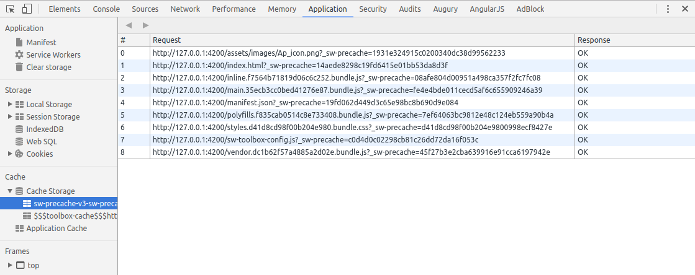
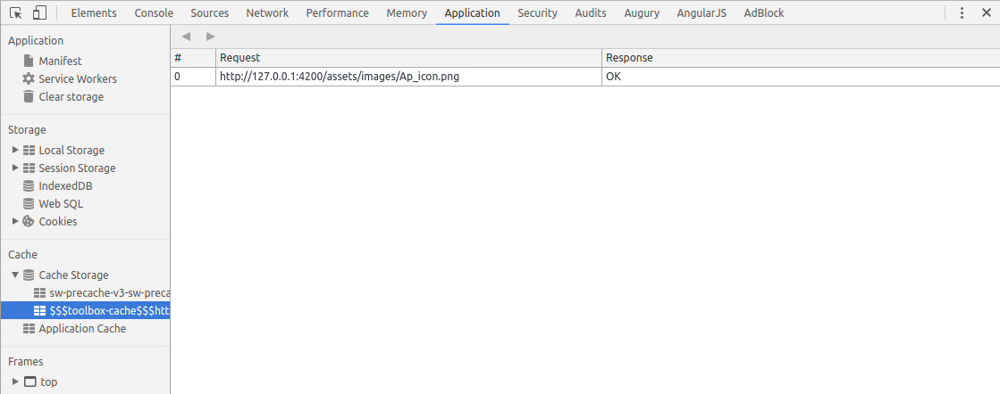
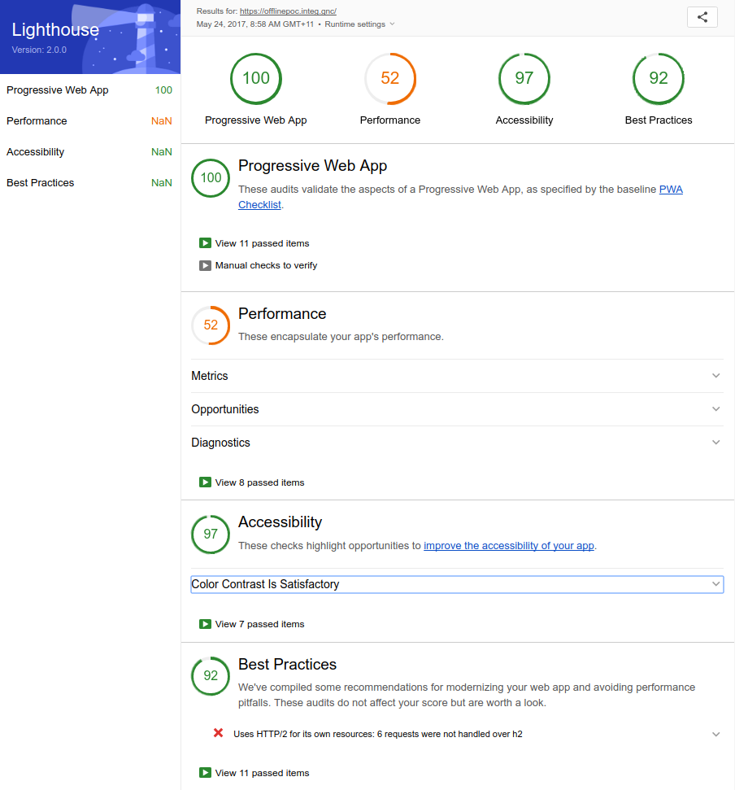

# OfflinePOC

This project was generated with [Angular CLI](https://github.com/angular/angular-cli) version 1.0.0.

## Development server

Run `ng serve` for a dev server. Navigate to `http://localhost:4200/`. The app will automatically reload if you change any of the source files.

## [Optional] Use yarn as default NPM packages manager

```
ng set --global packageManager=yarn
```

## Make it a progressive web app (PWA)

See full documentation @ `https://gitlab.ref.gnc/brett.coffin/mobile-scaffold`

1/ add this script to your `main.ts` file :
```
if (navigator['serviceWorker']) {

    navigator['serviceWorker'].register('service-worker.js')
      .then((reg) => {
        console.log('Service Worker registered', reg);

        if (!navigator['serviceWorker'].controller) {
          console.log('Service Worker is the latest version');
          return;
        }

        reg.addEventListener('updatefound', () => {
          console.log('updatefound!');
          window['updatefound'] = true;
        });

      }).catch((err) => {
      console.log('Service Worker registration failed: ', err);
    });

  }
```

2/ Install Service Worker Precache module : 
```
npm install --save-dev sw-precache
```

3/ Install sw-toolbox module : 
```
npm install --save-dev sw-toolbox
```

4/ Add an empty ̀`service-worker.js` file @ project's root level

5/ Add a `sw-precache-config.js` file @ project's root level :
```
module.exports = {
    navigateFallback: '/index.html',
    stripPrefix: 'dist',
    root: 'dist/',
    staticFileGlobs: ['dist/**/*.{js,html,css,png,jpg,gif,json,svg,ttf,woff,woff2}'],
    importScripts: ['sw-toolbox-config.js'],
    runtimeCaching: [
        {
            urlPattern: /^((https?|ftp):)?\/\/.*(jpeg|jpg|png|gif|bmp)$/,
            handler: function (request, values, options) {
                return toolbox.cacheFirst(request).catch(function () {
                    return toolbox.cacheOnly(new Request('/assets/images/Ap_icon.png'))
                })
            },
            options: {
                cache: {
                    name: 'image-cache',
                    maxEntries: 50
                }
            }
        }
    ]
};
```

6/ Add the `sw-toolbox-config.js` file in the `src`folder :
```
toolbox.precache(['/assets/images/Ap_icon.png']);
```

7/ Add the `manifest.json` file in `src` folder : 
```
{
  "name": "Offline POC",
  "short_name": "Offline POC",
  "icons": [
    {
            "src": "/assets/images/Ap_icon.png",
            "sizes": "200x200",
            "type": "image/png",
            "density": 0.75
        }
  ],
  "theme_color": "#000000",
  "background_color": "#e0e0e0",
  "start_url": "/index.html",
  "display": "standalone",
  "orientation": "portrait",
  "permissions": [
    "unlimitedStorage"
  ]
}
```

8/ Update your `index.html` file (inside `<head />` tag) :
```
  <link rel="manifest" href="/manifest.json">
  <meta name="viewport" content="width=device-width, initial-scale=1">
  <meta name='mobile-web-app-capable' content='yes'>
```

9/ Update `assets` in your `.angular-cli.json` file : 
```
        "manifest.json",
        "sw-toolbox-config.js",
        "service-worker.js"
```

10/ Run the application :
```
ng build --prod
npm run precache
cd dist && live-server --port=4200 --host=0.0.0.0 --entry-file=/index.html
```

11/  check the result in the developer console :
App manifest


service-worker


sw-precache


sw-toolbox


## Paginate list

```
npm install --save ngx-pagination
```

See full documentation @ `https://github.com/michaelbromley/ngx-pagination`

Update `app.module.ts` file :
```
(...)
import {NgxPaginationModule} from 'ngx-pagination';
(...)
@NgModule({
  (...)
  imports: [
    (...)
    NgxPaginationModule
  ],
  (...)
})
```

Update your template file, `people.component.html` file here : 
```
<ol>
        <li *ngFor="let perso of people | paginate: { itemsPerPage: 10, currentPage: p }" (click)="onSelect(perso)">
            {{ perso.name }}
        </li>
    </ol>
    <pagination-controls (pageChange)="p = $event" class="my-pagination"></pagination-controls>
```

## IOS support

See full documentation @ `https://developer.apple.com/library/content/documentation/iPhone/Conceptual/SafariJSDatabaseGuide/OfflineApplicationCache/OfflineApplicationCache.html`

Use the HTML5 Offline Application cache :

1/ modify the `index.html` file to declare the manifest file :
```
(...)
<html lang="fr" manifest="ios.manifest">
(...)
```

The file __must__ be served with a MIME type of `text/cache-manifest` and the file name __must__ end in `.manifest` 

2/ create a manifest file in your `src` folder :
```
CACHE MANIFEST
 
NETWORK:
https://swapi.co/api/people/
 
CACHE:
/assets/images/Ap_icon.png
/favicon.ico
/index.html
/inline.bundle.js
/main.bundle.js
/manifest.json
/offlinepoc-0.0.1.tgz
/polyfills.bundle.js
/service-worker.js
/styles.bundle.css
/sw-toolbox-config.js
/vendor.bundle.js
 
FALLBACK:
```

The `CACHE` section __should__ list every needed resource to operate correctly when offline.

The `NETWORK` section list resources to access using the network.

The `FALLBACK` section is __optional__ and list URL pair. The second URL is the fallback of the first one.

3/ Integrate the HTML5 Offline Application Cache in your application :
```
const appCache = window['applicationCache'];
    appCache.addEventListener('error', (e: any) => alert('Error: Cache failed to update!' + e.message), false);

    window.addEventListener('load', function (_) {
      appCache.addEventListener('updateready', function (e) {
        if (appCache.status === appCache.UPDATEREADY) {
          // Browser downloaded a new app cache.
          if (confirm(`Une nouvelle version de l'application est disponible.`)) {
            window.location.reload();
          } else {
            window.location.reload();
          }
        } else {
          // Manifest didn't changed. Nothing new to server.
        }
      }, false);

    }, false);
```


### Warning !

You can not cache external data (json data from REST API's) !


That's all !

## How to verify ?

Use the Google Chrome lighthouse extension. It validate the aspects of a Progressive Web App (see `https://developers.google.com/web/progressive-web-apps/checklist`).

Lighthouse example :


## How to test ?

This application has been tested on :
|         |                          |              |                     |
|---------|--------------------------|--------------|---------------------|
| __device__  | __Samsung Galaxy Note 10.1__ | __Apple iPad 2__ | __HTC One__ |
| __OS__      | Androïd 4.1.2            | iOS 9.3.5    | Androïd 5.0.2       |
| __browser__ | Chrome 58.0.3029.83      | Safari 9.0   | Chrome 58.0.3029.83 |
|

see :
- crowd testing
- dogfooding
